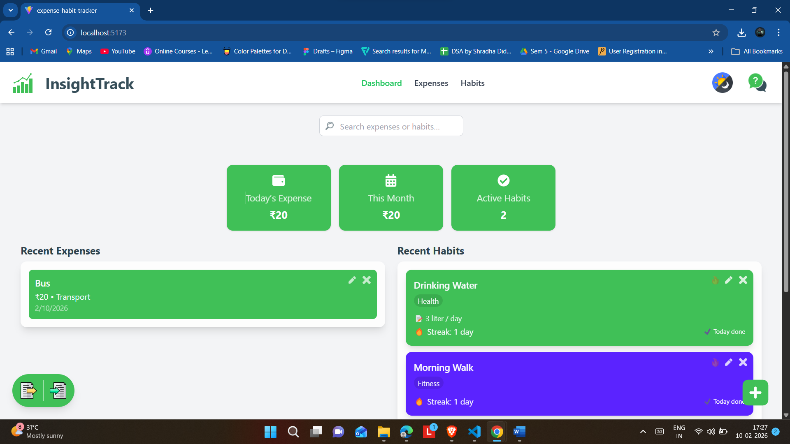
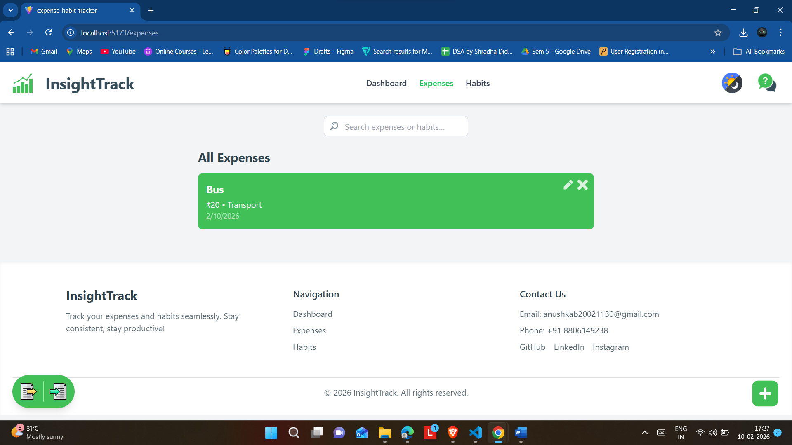
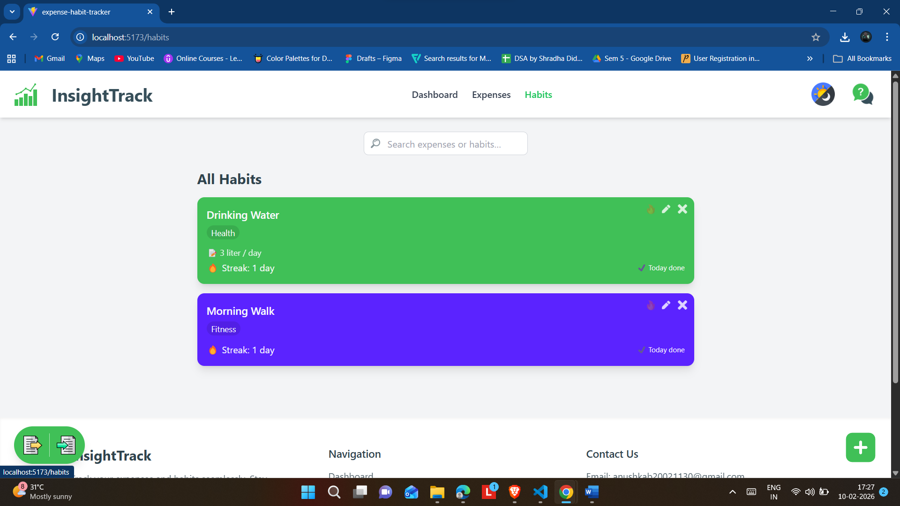
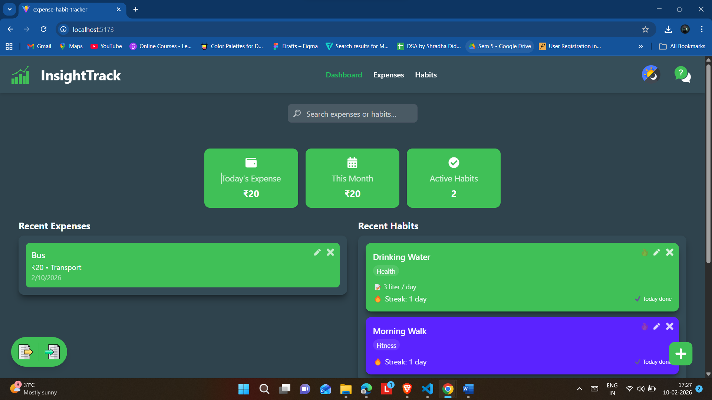

# InsightTrack

**InsightTrack** is a **React + Tailwind CSS web app** to track **expenses** and **habits** in one place. It helps users maintain consistency, analyze spending, and visualize daily activities through clean, responsive dashboards.

---

## 📌 Features

- Add, edit, and delete **expenses** with categories and notes
- Track **habits** with streaks and daily progress
- Search and filter expenses and habits
- Responsive, mobile-friendly design
- Light & Dark mode support

---

## 🛠️ Tech Stack

- **Frontend:** React.js, Tailwind CSS
- **State Management:** React Hooks
- **Tools:** VS Code, Git & GitHub
- **Languages:** JavaScript, HTML, CSS

---

## 🖼️ Screenshots

  
  



---

## 🚀 Getting Started

### 1. Clone the repository

```bash
git clone https://github.com/https-ab/InsightTrack.git
cd InsightTrack
